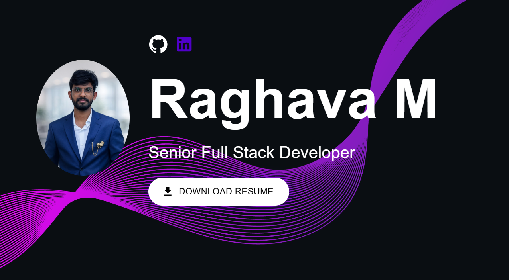

# Developer Portfolio Template 🚀

      

## 🌐 Developer Portfolio Template 🚀

A modern developer portfolio website built to showcase my professional experience, technical skills, and personal projects. This portfolio highlights my work in full-stack development, cloud technologies, and modern web frameworks.

The goal of this project is to present my projects, achievements, and technical expertise in an interactive and visually appealing way.

🚀 Live Demo

🔗 Portfolio Website:
[Portfolio Website](https://raghav-1303.github.io/)

## 📸 Portfolio Preview

Below is a preview of my developer portfolio showcasing my projects, skills, and professional experience.

## 🧑‍💻 About the Project

This portfolio application provides an overview of:

Professional experience and background

Technical skills and technologies

Personal and professional projects

Contact information and social links

It is designed with a modern UI, responsive layout, and customizable components so the content can easily be updated.

## 🛠 Tech Stack

This project is built using modern frontend technologies:

React

TypeScript

JavaScript

HTML5

SCSS / Sass

Node.js

npm

## ✨ Features

✔ Fully responsive design (mobile, tablet, desktop)

✔ Dark mode and light mode support

✔ Modular component-based architecture

✔ Easy customization of content and layout

✔ Project showcase section

✔ Skills and experience sections

✔ Contact and social media integration

## 📂 Project Structure
```
portfolio/
│
├── public
│   └── assets
│
├── src
│   ├── components
│   ├── pages
│   ├── assets
│   └── styles
│
├── package.json
└── README.md
```

## ⚙️ Installation & Setup

To run this project locally:

### 1️⃣ Clone the repository

```bash
git clone https://github.com/yourusername/your-repo-name.git
```

### 2️⃣ Navigate to the project directory
   
```bash
cd your-repo-name
```

### 3️⃣ Install dependencies
```bash
npm install
```

### 4️⃣ Start the development server
```bash
npm start
```

The application will run at:
http://localhost:3000 to view the app in the browser.

## 🧩 Customization

You can update the portfolio content easily by modifying files inside:

src/components

Typical updates include:

Personal information

Project descriptions

Skills and technologies

Profile images

Contact links

## 🚀 Deployment

This portfolio can be deployed using multiple platforms such as:

GitHub Pages

Netlify

Render

Vercel

For GitHub Pages deployment:

npm run deploy

After deployment, your portfolio will be available at:

https://yourusername.github.io/your-repo-name
 ## 📸 Screenshots

You can add screenshots of your portfolio here to show the UI and project sections.

## 📬 Contact

LinkedIn: [Linkedin](https://www.linkedin.com/in/raghava-dev10/)

GitHub: [github](https://github.com/Raghav-1303)

Email: raghava.dev@gmail.com

Phone: +1 817-382-9941

## ⭐ Support

If you find this project useful, feel free to star the repository. It helps others discover the project and supports future improvements.


    

